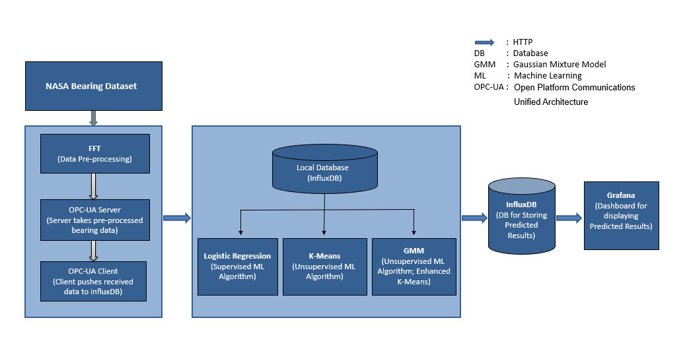
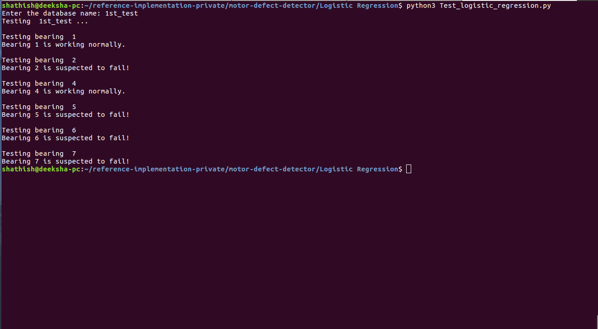
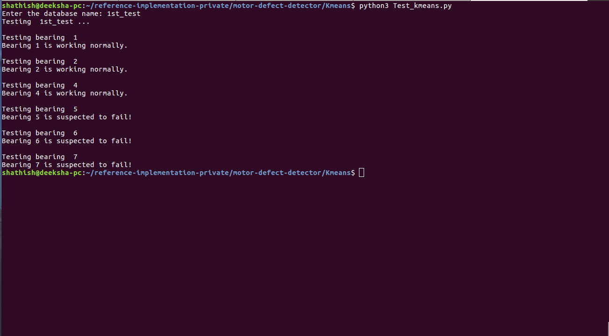
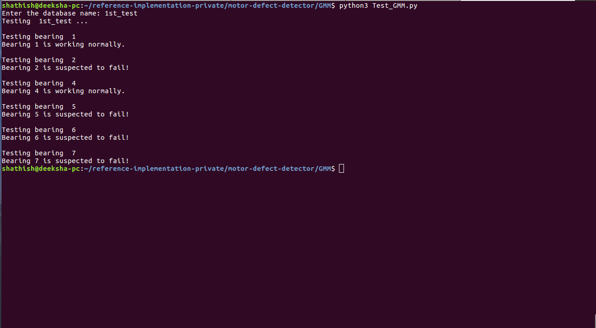
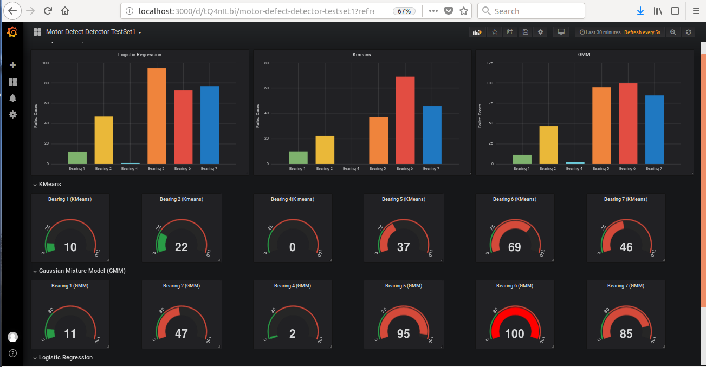

# DISCONTINUATION OF PROJECT #
This project will no longer be maintained by Intel.
Intel has ceased development and contributions including, but not limited to, maintenance, bug fixes, new releases, or updates, to this project.
Intel no longer accepts patches to this project.
# Motor Defect Detector

| Details          |                    |
|-----------------------|---------------|
| Target OS:            |  Ubuntu 16.04 LTS|
| Programming Language: |  C++, Python 3 |
| Time to Complete:    |  30 min     |

##  Introduction

The monitoring of manufacturing equipment is vital to any industrial process. It is critical to monitor the equipment in real-time for faults and anomalies prevention. Hence fault detection is the pre-cursor to predictive maintenance. Existing motors have PLC connected, and the collected data is processed and stored in database using OPC-UA protocol which is further used to perform analytics.

There are several machine learning models which don&#39;t require neural network to detect failures. These machine learning models are Gaussian Mixture Model (GMM), Logistic Regression, K-Means clustering, etc. These models have the advantage of being re-used with some minor modifications to be able to train on different data streams, and don&#39;t require a lot of labelled data (unlike neural networks). In fact, some of these methods can be used to classify data in order to train Deep Neural Networks.

## Requirements
### Hardware Requirements
* [TANK AIoT Dev Kit](https://software.intel.com/en-us/iot/hardware/iei-tank-dev-kit)
 
### Software Requirements
- Ubuntu 16.04
- InfluxDB v1.6.3
- Grafana v5.3.2

## Setup


### Download the Dataset
- Download "Bearing Data Set" from [https://ti.arc.nasa.gov/tech/dash/groups/pcoe/prognostic-data-repository/](https://ti.arc.nasa.gov/tech/dash/groups/pcoe/prognostic-data-repository/).

- Go to the directory where the data set is downloaded and extract the data set using the below commands:
    ``` 
    sudo apt-get install p7zip-full unrar
    7za x IMS.7z
    unrar x 1st_test.rar 
    unrar x 2nd_test.rar
    ```
### Python Dependencies 
   * numpy:1.14.0
   * pandas:0.22.0
   * matplotlib.pyplot:2.1.2
   * sklearn:0.19.1
   * scipy:1.1.0
   * python-setup tools

   Install python dependencies using the below commands:
   ```
   sudo apt install python-setuptools
   sudo apt install git
   sudo apt-get install -y python-six 
   sudo apt-get install python3-pip
   sudo python3 -m pip install matplotlib==2.1.2 scikit-learn==0.19.1 numpy==1.14 pandas==0.22.0 scipy==1.1.0
   sudo apt-get install python3-tk
   ```


### C++ Dependencies 
   * open62541

   Install C++ dependencies using the below commands:
   ```
   sudo apt install cmake
   git clone https://github.com/open62541/open62541.git
   cd open62541
   git checkout 0.3 
   mkdir build && cd build
   cmake -DCMAKE_BUILD_TYPE=Release -DBUILD_SHARED_LIBS=ON -DUA_ENABLE_AMALGAMATION=ON ..
   make
   sudo make install
   sudo ldconfig
   ```


### Install InfluxDB 

Install InfluxDB using the below commands:

```
sudo apt install curl
sudo curl -sL https://repos.influxdata.com/influxdb.key | sudo apt-key add - 
source /etc/lsb-release
echo "deb https://repos.influxdata.com/${DISTRIB_ID,,} ${DISTRIB_CODENAME} stable" | sudo tee /etc/apt/sources.list.d/influxdb.list
sudo apt-get update 
sudo apt-get install influxdb
sudo service influxdb start
```

### Install Grafana

Install Grafana using the below commands:
```
wget https://s3-us-west-2.amazonaws.com/grafana-releases/release/grafana_5.3.2_amd64.deb
sudo apt-get install -y adduser libfontconfig
sudo dpkg -i grafana_5.3.2_amd64.deb
sudo /bin/systemctl start grafana-server
```
### Install InfluxDB for Python
```    
sudo pip3 install influxdb
```
## How it Works
This reference implementation takes the input from the data set and do data preprocessing using FFT. The OPC-UA server reads this preprocessed data and send it to OPC-UA client, the client stores this data to influxDB.
Then this data is fetched from the database and is used to build three machine learning models i.e. Logistic Regression, K-Means clustering and GMM. The predictions we get from each of these models (i.e. which manufacturing equipment is suspected to fail) are again stored in the local database(influxDB) and are visualized on grafana. 

Below is the architectural diagram which shows each step of this application.

 


**Understanding the analysis methods**

**1. FFT:** Fast Fourier transform (FFT) is an algorithm that samples a signal over a period of time (or space) and divides it into its frequency components. These components are single sinusoidal oscillations at distinct frequencies, each having their own amplitude and phase.

[Y](https://in.mathworks.com/help/matlab/ref/fft.html#f83-998360-Y) = fft([X](https://in.mathworks.com/help/matlab/ref/fft.html#f83-998360-X)) computes the Discrete Fourier Transform (DFT) of X using a Fast Fourier Transform (FFT) algorithm. If X is a vector, then fft(X) returns the Fourier transform of the vector. [**More details**](https://en.wikipedia.org/wiki/Fast_Fourier_transform)

**2. OPC-UA:**  Open Platform Communication Unified Architecture (OPC UA) is a machine to machine communication protocol for industrial automation developed by the OPC Foundation. OPC UA is a sophisticated, scalable and flexible mechanism for establishing secure connections between clients and servers. [**More details**](https://en.wikipedia.org/wiki/OPC_Unified_Architecture)

**3. Logistic Regression:** Logistic Regression is a type of supervised machine learning algorithm and a statistical method for analyzing a data set in which there are one or more independent variables to determine an outcome.

In Logistic Regression, the dependent variable or the outcome is binary or dichotomous, i.e. it only contains data coded as 1 (TRUE, success, pregnant, etc.) or 0 (FALSE, failure, non-pregnant, etc.). The goal of logistic regression is to find the best fitting model to describe the relationship between the dependent variable and a set of independent (predictor or explanatory) variables. [**More details**](https://en.wikipedia.org/wiki/Logistic_regression)

**4. K-means Clustering:** K-means clustering is a type of unsupervised machine learning algorithm, which is used when you have unlabeled data (i.e. data without defined categories or groups). The goal of this algorithm is to find clusters in the data, where K is the number of clusters in the data set. The algorithm works iteratively to assign each data point to one of the K clusters based on the features that are provided i.e. data points are clustered based on feature similarity.

 The results of the K-means clustering algorithm are:

- The centroid of the K clusters, which can be used to label new data.
- Labels for the training data (each data point is assigned to a single cluster).
[**More details**](https://en.wikipedia.org/wiki/K-means_clustering)

**5. GMM:** A Gaussian Mixture Model is a probabilistic model that assumes all the data points are generated from a mixture of a finite number of gaussian distributions with unknown parameters. One can think of mixture models as generalizing k-means clustering to incorporate information about the covariance structure of the data as well as the centers of the latent gaussian.

The GaussianMixture object implements the expectation-maximization (EM) algorithm for fitting mixture-of-Gaussian models. It can also draw confidence ellipsoids for multivariate models, and compute the Bayesian Information Criterion to assess the number of clusters in the data. A GaussianMixture.fit method is provided that learns a Gaussian Mixture Model from train data. Given test data, it assigns the Gaussian to each sample it probably belongs to by using the GaussianMixture.predict method.

The GaussianMixture comes with different options to constrain the covariance of the different classes estimated: spherical, diagonal, tied or full covariance. [**More details**](https://en.wikipedia.org/wiki/Mixture_model)

**Code Explanation:**

**Fast Fourier Transform (FFT):**<br><br>
The data is preprocessed/reduced by using FFT for feeding it to the machine learning models i.e. Logistic Regression, K-means and GMM.

Following are the steps for data preprocessing/reduction:

- Take the FFT of each bearing from each file.
- Calculate the frequency and amplitude of it.
- Take the top 5 amplitude and their corresponding frequencies.
- Store the result in the result data frame.

It gives the frequency vs time plot for the dataset.

**Logistic regression:**

For training: Calculate the label for the "result" data frame. Label &#39;0&#39; is given for the bearings in normal condition and label &#39;1&#39; is given for the bearings that are suspected to fail. Train the logistic regression model on "result" data frame. Save the trained model as *logisticRegressionModel.npy*.

For testing: Take the input path of the data set from the user. Check the no. of ones and zeros from the label column in the last 100 predictions. If the no. of ones is greater than or equal to the set threshold, then the bearing is suspected to fail.

**K-means Clustering**:

For training: Fit the "result" data frame to K-means model and group the data set into K=8 clusters (the value of K is obtained from elbow method). Save the trained model as *kmeanModel.npy*.

For testing: Take the input path of the data set from the user. Calculate the total number of bearings present in clusters 4, 5, 6 and 7 in the last 100 predictions. If this sum is greater than or equal to the set threshold, then the bearing is suspected to fail.

**Gaussian Mixture Model (GMM):**

For training: Fit the "result" data frame to the GMM model and group the data set into 3 components (components depict no. of clusters). Save the trained model as *GMM_all.npy*.

For testing: Take the input path of the data set from the user. Calculate the total no. of bearings present in label 2 in the last 100 predictions. If this sum is greater than or equal to the set threshold, then the bearing is suspected to fail.


## Run the Application

* Clone the repository and go to the motor-defect-detector directory using the below command:
    ```
    cd <Path-to-motor-defect-detector>/motor-defect-detector
    ```

* Copy the bearing data set 1st_test and 2nd_test, extracted earlier, in motor-defect-detector directory:
    ```
    cp -r <Path-to-the-data-set>/1st_test .
    cp -r <Path-to-the-data-set>/2nd_test .
    ```

### Data Preprocessing

* Run data_preprocess.py
    ```
    python3 data_preprocess.py
    ```
    and provide the input as follows:
    
    **Enter the path to the data set, 1st_test:** 1st_test/<br>
    **Enter the path to the data set, 2nd_test:** 2nd_test/<br>

* Expected output:
    * 1st_test.csv
    * 2nd_test.csv

### Data Storing
1. Build the code

    * Give the executable permission to the script
        ```
        chmod u+x influxScript.sh
        ```
    * Compile the OPC-UA Server code
        ```
        g++ -Wno-write-strings opcuaServer.cpp -o opcuaServer -lopen62541
        ```
    * Compile the OPC-UA Client code
        ```
        g++ -Wno-write-strings opcuaClient.cpp -o opcuaClient -lopen62541
        ```

2. Run the code

    * Run the below commands for 1st dataset-

        * Run the below OPC-UA server command for 1st_test:
            ```
            ./opcuaServer 1st_test.csv
            ```
        * Open a new terminal by pressing Ctrl+Shift+T and run the below OPC-UA client command for 1st_test:
            ```
            ./opcuaClient 
            ```
    * Run the below commands for 2nd dataset-

        * Go to the first terminal and press Ctrl+C then run the below OPC-UA server command for 2nd_test:
            ```
            ./opcuaServer 2nd_test.csv
            ```
        * Run the below OPC-UA client command for 2nd_test on second terminal:
            ```
            ./opcuaClient 
            ```

    After receiving the data from the server, OPC-UA client disconnects automatically. After running the above command "1st_test" and "2nd_test" databases will be created in the influxDB.

### Testing Logistic Regression

* Navigate to the Logistic Regression directory present in motor-defect-detector directory:
    ```
    cd Logistic\ Regression/
    ```
* Run Test_logistic_regression.py 
    ```
    python3 Test_logistic_regression.py 
    ```
    and provide the input as follows:

    * For testing data set, 1st_test<br>   
       **Enter the database name:** 1st_test<br><br>
    * For testing data set, 2nd_test<br>   
       **Enter the database name:** 2nd_test<br>

* Expected output:<br>
      
    *Figure 2. Result of 1st_test using Logistic Regression.*

### Testing K-Means

* Navigate to the Kmeans directory present in motor-defect-detector directory:
    ```
    cd ..
    cd Kmeans/
    ```
* Run Test_kmeans.py 
    ```
    python3 Test_kmeans.py 
    ```
    and provide the input as follows:

    * For testing data set, 1st_test<br>   
       **Enter the database name:** 1st_test<br><br>
    * For testing data set, 2nd_test<br>   
       **Enter the database name:** 2nd_test<br>

* Expected output:
      
    *Figure 3. Result of 1st_test using K-means clustering.*


### Testing GMM

* Navigate to the GMM directory present in motor-defect-detector directory:
    ```
    cd ..
    cd GMM/
    ```
* Run Test_GMM.py:
    ```
    python3 Test_GMM.py 
    ```
    and provide the input as follows:

    * For testing data set, 1st_test<br>   
       **Enter the database name:** 1st_test<br><br>
    * For testing data set, 2nd_test<br>   
       **Enter the database name:** 2nd_test<br>

* Expected output:
      
    *Figure 4. Result of 1st_test using GMM.*

### Grafana

* On the terminal, run the following command to start grafana server:
    ```
    sudo /bin/systemctl start grafana-server
    ```
* Setting up the Grafana dashboard for data set 1st_test.

    * Open the browser, go to **http://localhost:3000**.

    * Log in with user as **admin** and password as **admin**.

    * Click on the **Configuration** icon present in the left menu bar and select **“Data Sources”**.

    * To add data source:
        * Click on **“+ Add data source”** and provide below inputs:
            * *Name*: Motor Defect Detector TestSet1
            * *Type*: InfluxDB
            * *URL*: http://localhost:8086
            * *Database*: *Predictions_testset1* 
            * Click on “Save and Test”

* For creating the dashboard for data set 1st_test, follow the below steps:

    * Click on + sign on the left menu bar and select **Import** option.
    * Click on **Upload .json file** option and select **motorDefectDetectorTestSet1.json** from motor-defect-detector       directory.
    * Give **Name** as *Motor Defect Detector TestSet1* and select the InfluxDB data source as  **Motor Defect Detector      TestSet1**.
    * Click on import.

* For creating the dashboard for data set 2nd_test, follow the previous steps with the below changes:
    *  To add data source:
        * Click on **“+ Add data source”** and provide below inputs:
            * *Name*: Motor Defect Detector TestSet2
            * *Type*: InfluxDB
            * *URL*: http://localhost:8086
            * *Database*: *Predictions_testset2*
            * Click on “Save and Test”

    *   Import **motorDefectDetectorTestSet2.json** file. Give **Name** as *Motor Defect Detector TestSet2* and select InfluxDB data source as *Motor Defect Detector TestSet2*.

    
    *Figure 5. Visualization of results for 1st_test on Grafana.*

## Optional
### Training Logistic Regression machine learning model

* Navigate to the Logistic Regression directory present in motor-defect-detector directory.
* Run the script **Train_logistic_regression.py**
    ```
    cd ..
    cd Logistic\ Regression/
    python3 Train_logistic_regression.py
    ```

### Training KMeans machine learning model

* Navigate to the K-means directory present in motor-defect-detector directory.
* Run the script **Train_kmeans.py**
    ```
    cd ..
    cd Kmeans/
    python3 Train_kmeans.py
    ```
### Training GMM machine learning model

* Navigate to the GMM directory present in motor-defect-detector directory.
* Run the script **Train_GMM.py**
    ```
    cd ..
    cd GMM/
    python3 Train_GMM.py
    ```

### **NOTE:**
If one is training the model again, instead of using the given models, results may vary.

TESTSET 3 of the NASA bearing data set is discarded for the observations because of the following reason:

1: It has a 6324 data files in actual, but according to the documentation it contains a 4448 data files. This makes very noisy data.

2: None of the bearing shows the symptom of failure. However, it suddenly fails. This makes the data inconsistent

Thus, this show that testset3 shows an unpredictable behavior.

## (Optional) Saving Data to the Cloud
As an optional step you can take the data results and send these to an Amazon Web Services (AWS)*  instance for storing and graphing.

1\. Make an EC2 Linux* instance on AWS
([*https://docs.aws.amazon.com/AWSEC2/latest/UserGuide/EC2\_GetStarted.html*](https://docs.aws.amazon.com/AWSEC2/latest/UserGuide/EC2_GetStarted.html))

2\. Install InfluxDB* on EC2 Linux instance
([*https://github.com/influxdata/influxdb*](https://github.com/influxdata/influxdb))

3\. Install Grafana on EC2 Linux instance
([*https://grafana.com/get*](https://grafana.com/get))
